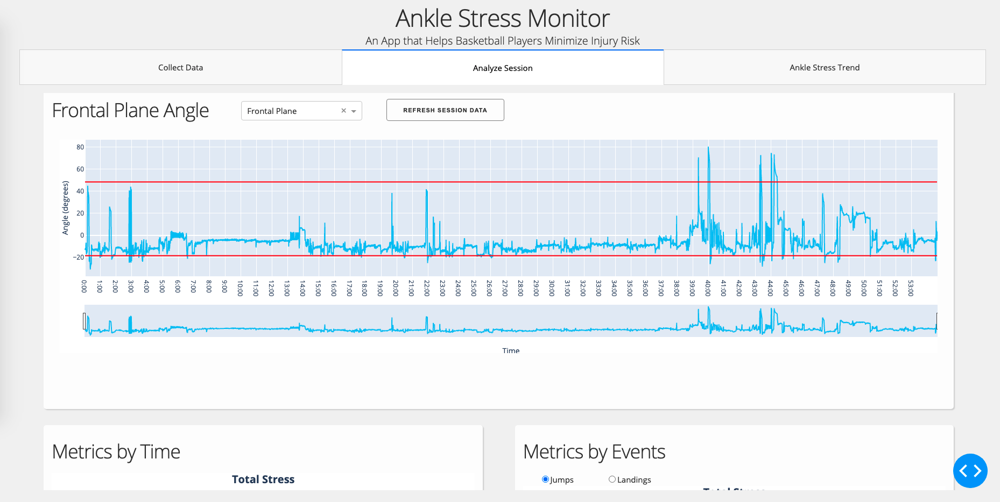
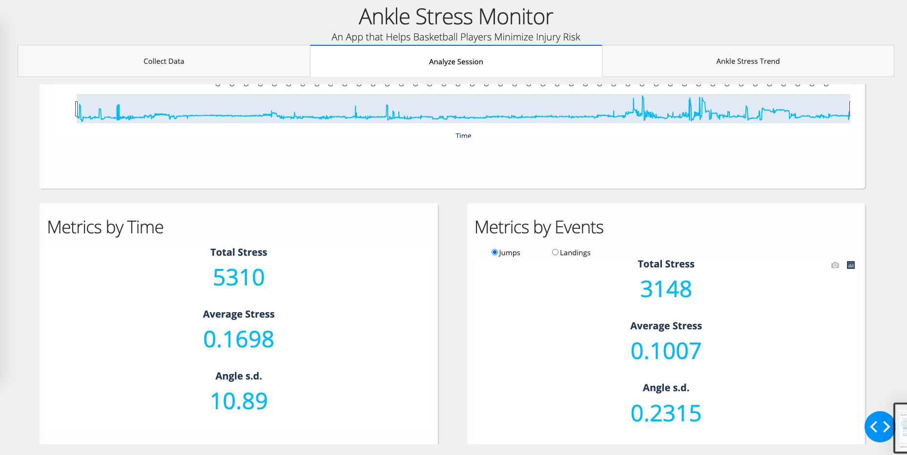
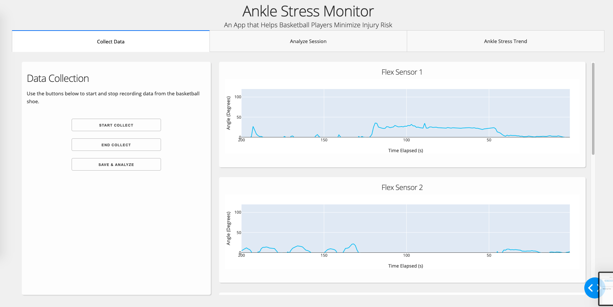
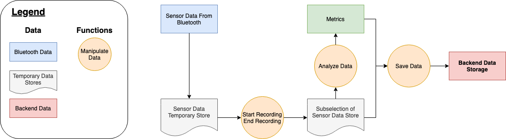
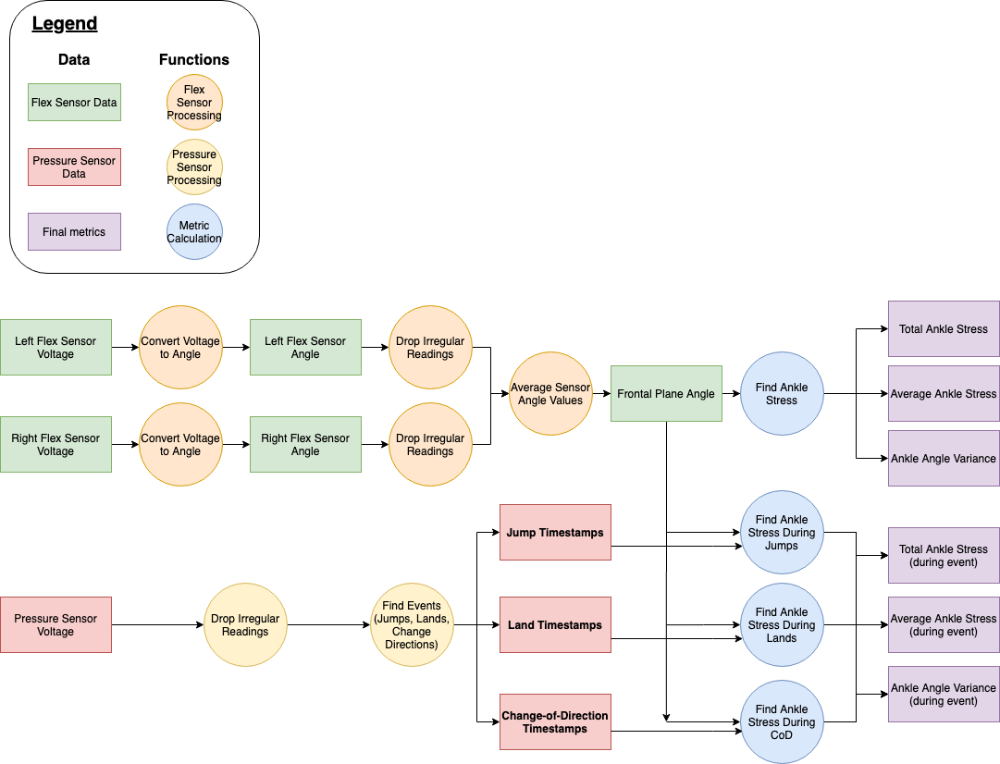
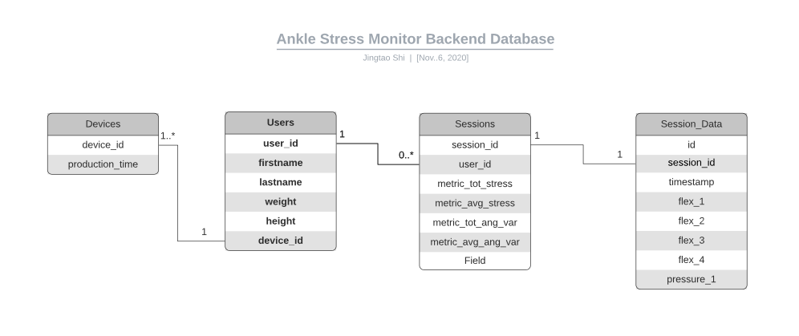

# Senior-Design

This repo contains the software part of my team's senior design project.

We built a shoe device that collects data on the stress levels of basketball players ankles and built an UI to help monitor an athlete's health.

# UI Demo

# Design
## Frontend Data Flow

## Metrics Calculation

## Backend

